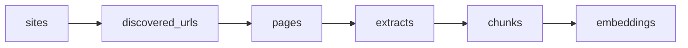

# End-to-End Data Flow



This is the pipeline that feeds retrieval for the `connections` site (`site_id=2`).

1. Crawl starts from `sites.root_url` and discovers internal links.
2. Scrape fetches each discovered URL and stores HTML in `pages`.
3. Parse transforms each page HTML into long extracts and then 1k-ish chunks.
4. Embed encodes chunk text into vector bytes for similarity search.

Core implementation files:

- `core/crawl.py`
- `core/scrape.py`
- `core/parse_content.py`
- `core/embed.py`
- `core/daily_connections_refresh.py`
- `core/fastlite_db.py`

# Stage-by-Stage Details

## 1. Crawl (URL Discovery)

Main function: `crawl_site(db, site_id, max_pages, delay)` in `core/crawl.py`.

Behavior:

- Loads site config from `sites`.
- BFS-style traversal from `root_url`.
- Normalizes and keeps only internal links.
- Persists discovered links to `discovered_urls` (`url` is unique).
- Classifies links with `_link_kind` (`html` vs `pdf`) before storing.

Notes:

- Crawl only discovers links; it does not create chunks or embeddings.
- Crawl cost can dominate run time because link classification calls `HEAD` per link.

## 2. Scrape (Fetch + Change Detection)

Main function: `fetch_page(...)` in `core/scrape.py`.

For each URL:

- `GET` page HTML.
- Compute stable content hash with `compute_content_hash(html, selector)`.
  - Uses site selector from `sites.selector` when available.
  - Removes scripts/styles/comments to reduce dynamic noise.
  - Hashes normalized visible text + link pairs.
  - Hash format is versioned: `v2:<md5>`.
- Returns one status: `new`, `changed`, or `unchanged`.
- Updates DB:
  - `new`: insert page row.
  - `changed`: update HTML + hash + `last_changed`.
  - `unchanged`: update `last_scraped` only.

This status is what gates parse/embed work in the daily refresh job.

## 3. Parse (HTML -> Extracts -> Chunks)

Main function: `process_pages_to_extracts_and_chunks(db, page_ids, ...)` in `core/parse_content.py`.

For each changed/new page:

- Select and transform content using site-specific split function:
  - `split_md_sections` (site 1 style)
  - `split_with_tabs` (connections style)
- Build extract text with optional breadcrumb prefix:
  - `Context: A > B > C`
- Split extracts into chunk-sized units (`max_chunk_len=1000`) with header-aware breaks.
- Rewrite only target pages:
  - clear old extracts/chunks for that page
  - insert fresh extracts/chunks

Output tables:

- `extracts(page_id, extract_index, text)`
- `chunks(extract_id, chunk_index, text)`

## 4. Embed (Chunks -> Vectors)

Main functions in `core/embed.py`:

- `generate_embeddings_for_chunk_ids(db, chunk_ids, batch_size=64)`
- `generate_embeddings_for_chunks(db, batch_size=64)` (full scan fallback)

Behavior:

- Uses model `BAAI/bge-small-en-v1.5`.
- Encodes only chunks missing vectors.
- Stores bytes in `embeddings(chunk_id, embedding)`.

After embedding, retrieval can use new vectors immediately in that process. If API is running in a different process, refresh/restart retrieval cache there as needed.

# Daily Refresh Job

Main entrypoint: `core/daily_connections_refresh.py`

Default run sequence:

1. Optional crawl (discover new URLs)
2. Scrape all discovered HTML URLs
3. Parse only `new/changed` pages
4. Embed only chunks from those pages
5. Optional local retrieval cache refresh

Recommended command:

```bash
uv run python -m core.daily_connections_refresh --site-id 2 --skip-crawl
```

URL discovery command (less frequent):

```bash
uv run python -m core.daily_connections_refresh --site-id 2
```

# Timings (Observed)

Observed on local Windows machine, measured on **February 11, 2026**. Treat as directional; network and site behavior vary.

## Refresh Without Crawl (Current Stable Hash Logic)

Command:

```bash
uv run python -m core.daily_connections_refresh --db-path <temp-copy.db> --skip-crawl --limit-urls 25 --no-cache-refresh
```

Observed:

- `target_urls=25`
- fetch phase: `100.34s`
- parse phase: skipped (`urls_changed=0`)
- embed phase: skipped
- total wall time: `112.70s`

Throughput estimate from this sample:

- fetch-only: about `4.0s` per URL
- for `~382` discovered URLs: about `25-30 minutes` total (skip crawl, mostly unchanged pages)

## Refresh With Forced Changes (Parse/Embed Cost Sample)

Sample where 10 page hashes were intentionally forced stale before run:

- `target_urls=10`
- fetch phase: `41.46s`
- parse phase: `1.23s` (`pages=10`, `extracts=4`, `chunks=25`)
- embed phase: `2.43s` (`25` embeddings)
- total wall time: `57.50s`

Interpretation:

- In this pipeline, network fetch is typically the dominant cost.
- Parse/embed are comparatively small unless very large numbers of pages change.

## Crawl Cost Sample

A bounded crawl-only timing attempt (`max_pages=1`) exceeded `244s` timeout in this environment.

Interpretation:

- Crawl can be significantly slower than refresh-only runs.
- Run crawl less frequently than scrape refresh unless aggressive URL discovery is required.

# Suggested Update Frequencies

## Production Cadence

1. **Daily (or twice daily): refresh existing discovered URLs**
   - Command: `uv run python -m core.daily_connections_refresh --site-id 2 --skip-crawl`
   - Why: keeps content current with predictable runtime.

2. **Weekly (off-hours): include crawl for new URL discovery**
   - Command: `uv run python -m core.daily_connections_refresh --site-id 2`
   - Why: crawl is the expensive stage.

3. **On demand: debug/sample run**
   - Command: `uv run python -m core.daily_connections_refresh --site-id 2 --skip-crawl --limit-urls 25 --no-cache-refresh`
   - Why: quick health check without full run.

# Operational Checks

Each run prints a summary with the key metrics:

- `urls_new`, `urls_changed`, `urls_unchanged`, `urls_failed`
- `pages_reparsed`, `extracts_written`, `chunks_written`, `embeddings_written`
- phase timings (`Fetch phase`, `Parse phase`, `Embed phase`)

Use those counters for schedule tuning and anomaly detection.
